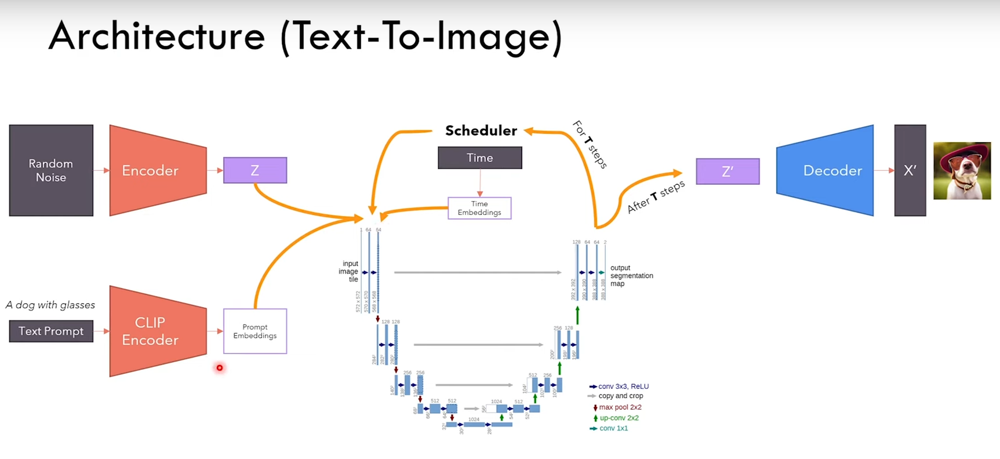

# InstaFlow_emoji

Respecialization of an Instaflow (https://huggingface.co/spaces/XCLiu/InstaFlow) like diffusion model 
on the russian emojis dataset (https://www.kaggle.com/datasets/shonenkov/russian-emoji?select=rgba_valid).

## Env

Python 3.11 

Requirements :
```bash
pip install -r requirements.txt
```

## Base model, stable diffusion



Base model :
https://huggingface.co/runwayml/stable-diffusion-v1-5/tree/main

Weights for inference only : https://huggingface.co/runwayml/stable-diffusion-v1-5/resolve/main/v1-5-pruned-emaonly.ckpt?download=true
(4.27GB)

Weights for finetuning : https://huggingface.co/runwayml/stable-diffusion-v1-5/resolve/main/v1-5-pruned.ckpt?download=true
(7.7 GB)

For the Tokenizer :
- Merges : https://huggingface.co/runwayml/stable-diffusion-v1-5/resolve/main/tokenizer/merges.txt?download=true
- Vocab : https://huggingface.co/runwayml/stable-diffusion-v1-5/resolve/main/tokenizer/vocab.json?download=true

Everything must be in the `stable_diffusion_files` folder.

You can run directly the `download_stable_diffusion.sh` script with flag -i and/or -f for respectively inference or finetuning weights :
```bash
./download_stable_diffusion_files.sh
```

## InstaFlow model

[TODO] : Expliquer les particuarités d'InstaFlow

## Data

The data set comes from : 
https://www.kaggle.com/datasets/shonenkov/russian-emoji/download?datasetVersionNumber=6

Keep the structure as :
```
dataset/
├──────/images/
├──────/rgba_train/
├──────/rgba_valid/
└──────/marking.csv
```

If you are using the kaggle API, you can lunch download_data.sh directly :
```bash
./download_emoji_dataset.sh
```

## Doc

### InstaFlow
InstaFlow paper : https://arxiv.org/abs/2309.06380

InstaFlow GitHub : https://github.com/gnobitab/InstaFlow?tab=readme-ov-file

### RectifiedFlow
RectifiedFlow GitHub : https://github.com/gnobitab/RectifiedFlow

### StableDiffusion
StableDiffusion GitHub : https://github.com/CompVis/stable-diffusion

Model from scratch : https://www.youtube.com/watch?v=ZBKpAp_6TGI

### Similar model : EmojiDiffusion
EmojiDiffusion model : https://huggingface.co/valhalla/emoji-diffusion


